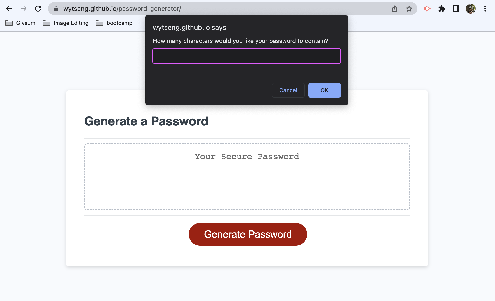
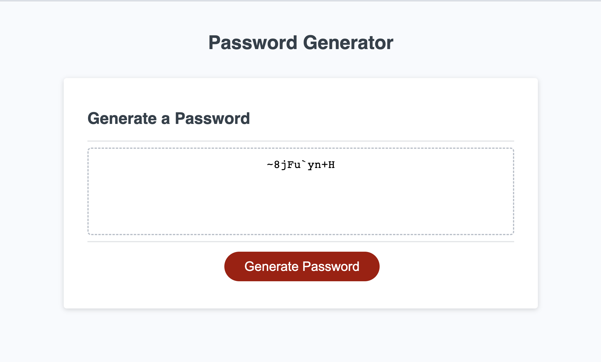

# A Password Generator

## Description

This website generates a random password that matches the user's input criterias. The genarator allows users to enter a password length between 8 and 128 characters, and have options to include special, numerical, lowercase and uppercase characters. 
This application will make password creation a much easier process while keeping the password's security strength. 

## Installation

N/A

## Usage

Here is the link to the password generator: 

Users can start the password generating process by clicking on the red "Generate Password" button.

A pop up window will then prompt you to enter the length of the password, followed by some confirmation prompt for whether to include special, numeric, lowercase or uppercase characters. 

Note that an invalid input, or not including any of the 4 types of characters will give an alert and exit the process. But you may start over as you wish by clicking on the red button again. 

The generated password will appear in the dotted container on the html page. The password should contain at least one character of each charater type that the user confirmed to include. 

(In this sample, the password length is 10 and includes all 4 types of characters.)

## Credits

N/A

## License

N/A